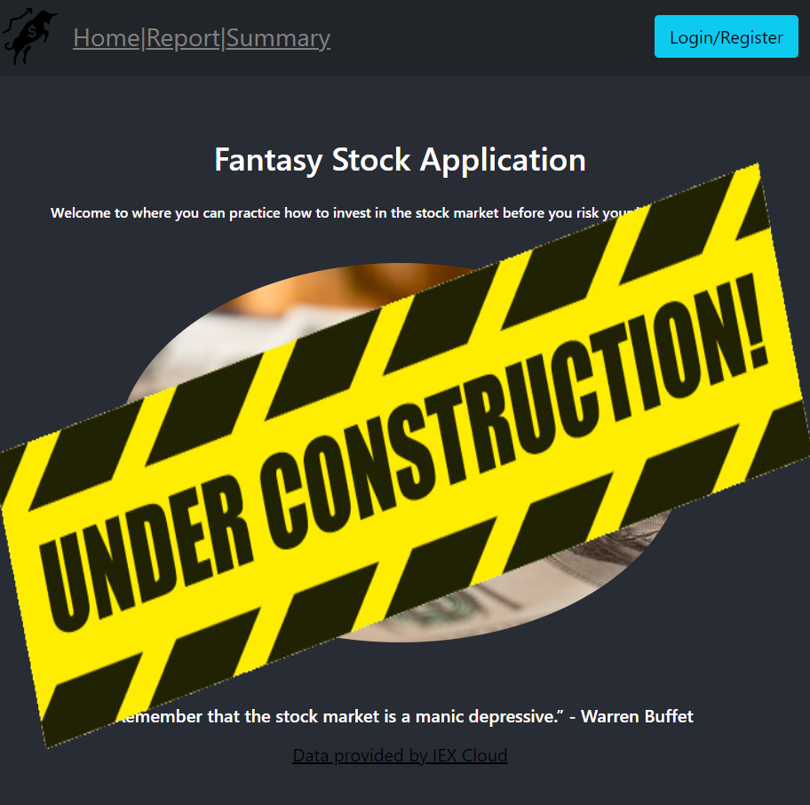
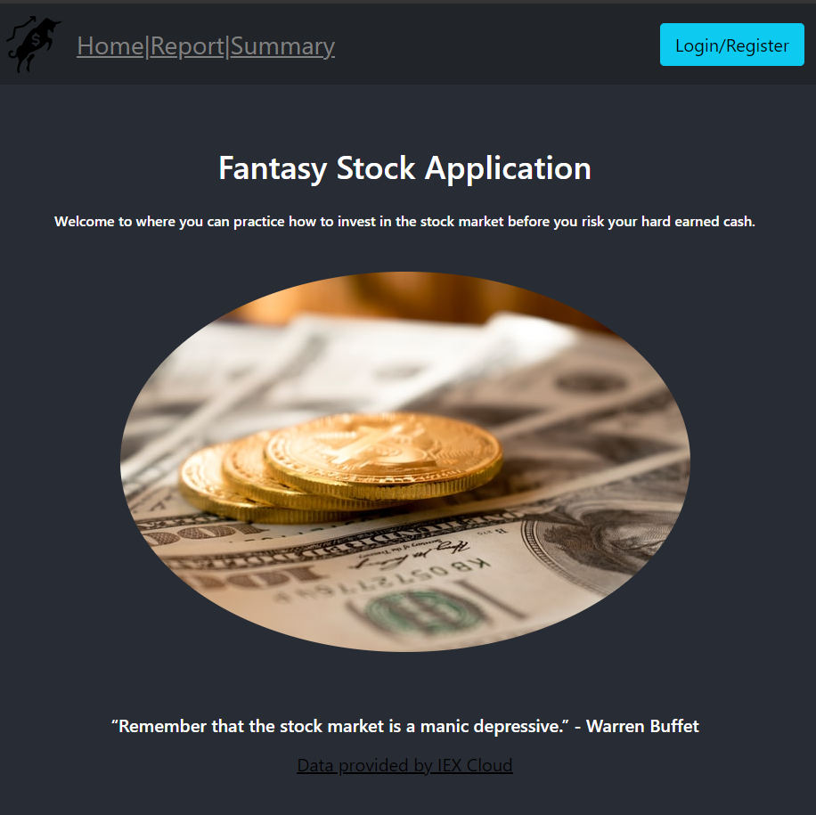

<!-- Installation Instructions
1) Install postgres
2) Run backup.sql script in sql_backup directory -->

<!-- # Fantasy Stock App Created with React, Flask, Postgres, IEX Cloud API

Click [here](https://fantasy-stock-app.herokuapp.com/) to invest with no regrets!

# Summary

This app was the biggest milestone for me. I learned a lot going through this application. I actually started playing around with the actual stock market to see what is going to be needed as the user. That helped me put together the application and include the features that will be needed. I started with a wireframe before implementing each page. The challenge was that I had to ALSO implement a database using Postgres. That was a fun challenge. The hardest part was when it came time to connect it to my application and deploy on Heroku.

I got to play around with different SQL queries to get the data needed to display on the application. I used the IEXCloud API for the stock market data. That was fun until I ran out of credits due to the amount of times the app was fetching each render. I had to adjust the useEffect Hook to prevent it from eating up all the credits I was given. This was my 4th React app so I also wanted to challenge myself and just use functional components in order to get a better feel for them versus reverting back to class components. It was challenging at first but then as I continued to use it, I actually found that they were not that hard to do were even cleaner and easier to separate state!

When it came time to deploy the application on Heroku, I had a few troubles. I reverted back to the Heroku documentation many times in order to get the application deployed. I got a better handle reading the logs to find out what the issue was. Once I managed to deploy it, I found that the database was not connecting. I read the Heroku Postgres documentation to figure out that I had to import the psycopg2-binary package vs just psycopg2. Once I did that, everything worked as expected. I made use of the different documentations at my disposal to put the stock app together.

The fantasy stock app really put me to the test. I enjoyed every minute of it. Even the times I was stuck trying to figure out different errors for hours at a time. I feel great satisfaction having completed this full stack application. I am looking forward to the next challenge! -->

# Author
* Johnny Redry Briones Jr. - *Programmer*
* [Portfolio](https://www.johnnybrionesjr.com/)
* [LinkedIn](https://www.linkedin.com/in/johnny-briones-b6068383/)